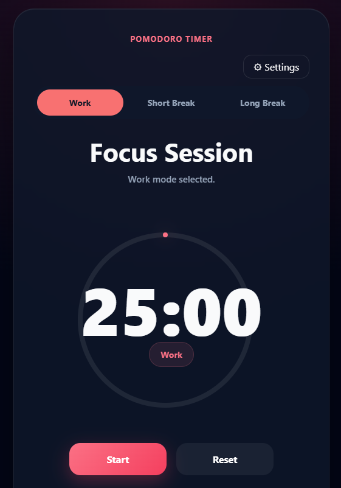
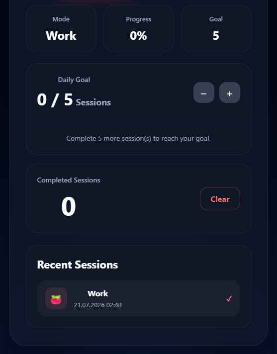

# 🍅 Pomodoro Timer

A modern and customizable Pomodoro Timer built with **React** and **Vite** to improve focus and productivity.

🔗 **Live Demo:** https://pomodoro-timer-psi-puce.vercel.app/

---

## 📸 Preview

> Add a screenshot of the application here.

Example:

(())

---

## ✨ Features

- ⏱️ 25/5/15 Pomodoro workflow
- 🎯 Daily goal tracking
- 📊 Circular progress indicator
- 📈 Session progress
- 📚 Session history
- 🔔 Sound notifications
- 🔇 Enable / Disable alarm sounds
- ⚙️ Custom work & break durations
- 💾 Persistent settings with Local Storage
- 📱 Responsive design
- 🎨 Modern UI

---

## 🛠️ Built With

- React
- Vite
- JavaScript (ES6+)
- CSS3
- React Hooks
- Local Storage API

---

## 🚀 Getting Started

Clone the repository

```bash
git clone https://github.com/Aley777/PomodoroTimer.git
```

Go to the project folder

```bash
cd PomodoroTimer
```

Install dependencies

```bash
npm install
```

Run the development server

```bash
npm run dev
```

Build for production

```bash
npm run build
```

---

## 📂 Project Structure

```
src/
│
├── assets/
├── components/
│   ├── MiniStats.jsx
│   ├── SessionHistory.jsx
│   ├── SettingsModal.jsx
│   ├── StatsPanel.jsx
│   └── TimerRing.jsx
│
├── constants/
│   └── timerModes.js
│
├── hooks/
│   ├── useAlarm.js
│   └── useTimer.js
│
├── utils/
│   └── timerUtils.js
│
├── App.jsx
└── App.css
```

---

## 🎯 Future Improvements

- Dark / Light theme
- Keyboard shortcuts
- Statistics dashboard
- Weekly productivity report
- Multiple alarm sounds

---

## 👩‍💻 Author

**Aleyna Aydoğdu**

GitHub: https://github.com/Aley777